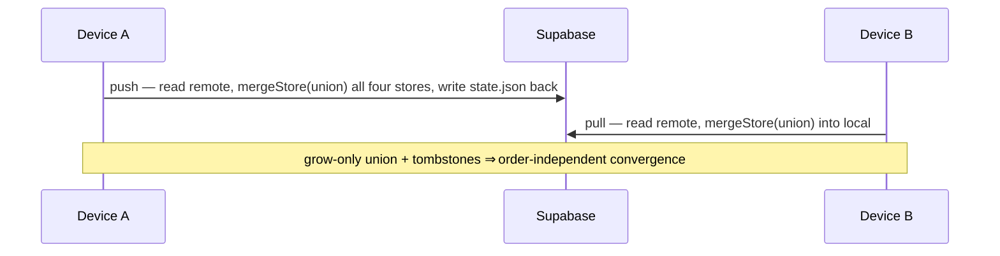
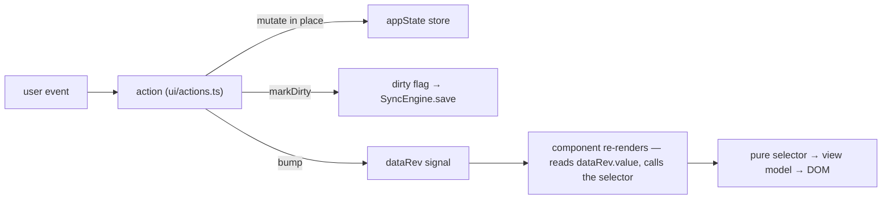

# Meridian — Architecture

Meridian is a personal, offline-first **fitness + study tracker** delivered as an
installable PWA. It runs entirely in the browser, persists locally, and syncs to the
cloud opportunistically. This document is the map of how the codebase is organized, the
rules that keep it coherent, and the load-bearing invariants you must not break.

> Audience: a developer changing this code. It describes the system **as built**, not a
> roadmap. Behavioral specs (the workout/nutrition and knowledge engines) and style guides
> live in [`docs/`](docs/) — see [§13](#13-where-to-look-next).

## Contents

1. [At a glance](#1-at-a-glance)
2. [Layering](#2-layering)
3. [Directory map](#3-directory-map)
4. [The data model — four stores](#4-the-data-model--four-stores)
5. [Persistence and sync](#5-persistence-and-sync)
6. [The reactive UI](#6-the-reactive-ui)
7. [Navigation & Back](#7-navigation--back)
8. [Pure selectors](#8-pure-selectors)
9. [Feature notes](#9-feature-notes)
10. [Services, landing & boot](#10-services-landing--boot)
11. [Testing](#11-testing)
12. [Build, PWA, and deploy](#12-build-pwa-and-deploy)
13. [Where to look next](#13-where-to-look-next)
14. [Invariants](#14-invariants)
15. [Cookbook — how to change things safely](#15-cookbook--how-to-change-things-safely)

---

## 1. At a glance

| | |
|---|---|
| **UI** | [Preact](https://preactjs.com/) + [`@preact/signals`](https://preactjs.com/guide/v10/signals/) (fine-grained reactivity, no VDOM diff storms) |
| **Language** | TypeScript, strict; ES modules; `@/` path alias → `src/` |
| **Build** | [Vite](https://vitejs.dev/); `tsc --noEmit` gates every build |
| **PWA** | [`vite-plugin-pwa`](https://vite-pwa-org.netlify.app/) (Workbox) — precache + `autoUpdate`, offline-capable |
| **Spaced repetition** | [`ts-fsrs`](https://github.com/open-spaced-repetition/ts-fsrs) (FSRS) via an adapter |
| **Landing** | [Three.js](https://threejs.org/), lazy-loaded behind an Enter gate |
| **Persistence** | localStorage + IndexedDB (dual-write, self-healing) |
| **Cloud sync** | Supabase Storage — all four stores in one `state.json` object, grow-only CRDT merge (deletes via tombstones — see [§5](#5-persistence-and-sync)) |
| **AI** | OpenRouter → DeepSeek, brokered by a Supabase Edge Function proxy (key never on device) |
| **Tests** | [Vitest](https://vitest.dev/) + [fast-check](https://fast-check.dev/) property tests; jsdom for components |
| **Deploy** | GitHub Actions → GitHub Pages on push to `main`, base `/meridian/` |

**Design principles**

1. **Offline-first.** Every read/write works with no network. Sync is an enhancement, never a dependency.
2. **Pure core, thin edges.** Domain logic is pure functions of `(state, today, config)`. The DOM, the clock, and the network live only at the edges.
3. **Derive, don't store.** User-facing numbers (mastery %, week strength, macros) are *computed* from the log, never cached — a cached number is a corruption surface.
4. **One-way data flow, opt-in reactivity.** State mutates through the actions layer, which bumps a single revision signal (`dataRev`); each view **subscribes by reading `dataRev.value`**, so a bump re-renders exactly the views that opted in (the leaf-subscription rule — see [§6](#6-the-reactive-ui)).

---

## 2. Layering

The tree is **feature-sliced**. The load-bearing rule is about the **pure logic**, not the
whole tree: pure code points strictly downward, and **`core` imports nothing upward**. The
*view components* are a deliberate exception — they depend on `ui`, forming an intentional
`ui ↔ views` cycle.

```mermaid
graph TD
    app["app/ — bootstrap, render"]
    ui["ui/ — signals, actions, App, components, charts"]
    views["features/*Tab.tsx — view components"]
    selectors["features/*Selectors.ts — pure domain logic"]
    services["services/ — ai, weather"]
    landing["landing/ — Three.js gate"]
    core["core/ — types, util, sync, storage, data, ports"]

    app --> ui
    app --> landing
    ui --> views
    views -.->|intentional cycle: store · actions · host · charts| ui
    ui --> services
    views --> services
    ui --> selectors
    ui --> core
    views --> selectors
    selectors --> core
    services --> core

    classDef pure fill:#1e2a1e,stroke:#4a7;
    class core,selectors pure;
```



- **`core/`** has **no DOM and no Preact**. It is pure TypeScript: types, utilities, the
  sync engine + merge algebra, the storage layer, seed data, and the host *ports*
  (`appHost.ts`). It imports nothing upward and can be unit-tested in a bare node environment.
- **`features/<domain>/`** owns one domain each. A slice is a pure **`*Selectors.ts`**
  (all the logic — imports only `core`) + a **`*Tab.tsx` / components** (the render) + `types.ts`.
- **`ui/`** is the Preact application shell — the signal store, the actions (command layer),
  the root `App`, shared components, and charts.
- **`services/`** wraps the two external I/O surfaces (AI, weather); reached from `ui/actions.ts`.
- **`app/`** wires everything together and renders.

**The rule (precise):** `*Selectors.ts` import only `core`; `core` imports nothing upward.
The **view components** deliberately depend on `ui` (`store`, `actions`, `host`, `charts`),
while `ui/App.tsx` renders them — an accepted cycle. The value it buys: the **pure layer stays
clean and testable**, which the `*Selectors.ts` → `core`-only discipline guarantees (grep any
`*Selectors.ts` for `@/ui` — there are none).

---

## 3. Directory map

Folder-level, with one-line purposes. The code is the source of truth for exact filenames —
this map deliberately does **not** enumerate every leaf file (that rots fastest).

```
src/
├── app/            # bootstrap.ts (composition root: stores + SyncEngine wiring), main.tsx (landing gate → render)
│
├── core/           # ── pure, no DOM/Preact ──
│   ├── types.ts    # every persisted shape (WorkoutState, MealState, KnowledgeState, CoreState, …)
│   ├── util.ts     # shiftDate, toId, toNum, tombstoneIds, …
│   ├── appHost.ts  # the AppHost "ports" interface (the impure surface actions may use)
│   ├── coreSelectors.ts  # XP / streak / schedule logic over the core store
│   ├── sync/       # SyncEngine.ts (save/push/forcePush; revs, backoff) · mergeStores.ts (the CRDT)
│   ├── storage/    # appState.ts (state owner) · store.ts (boot read/heal) · adapters.ts (storage + cloud adapters)
│   └── data/       # baked-in seed content (JSON) + a typed index
│
├── features/       # ── one slice per domain: pure *Selectors.ts + *Tab.tsx/components + types ──
│   ├── workout/    # progression, week-strength grading; away/home substitutes
│   ├── meal/       # calories/protein vs target; body-weight trend
│   ├── knowledge/  # fsrs, ascent, knowledgeSelectors, source, questionBank, AscentSession, KnowledgeRail
│   ├── data/       # export/import/normalise (dataSelectors), DataTab
│   ├── today/      # the hub / at-a-glance (hubStats)
│   ├── todos/  scratch/   # small core-store features
│
├── ui/             # ── the Preact shell ──
│   ├── store.ts    # ALL UI signals (nav, per-tab state, dataRev)
│   ├── actions.ts  # the command layer: mutate a store → markDirty → bump; also nav (handleBack, navHome)
│   ├── App.tsx     # brandrow + tab router + chrome (RestBar, SaveChip) + the screenKey animation key
│   ├── host.ts     # the concrete host adapter (readValue/setValue, confirm/prompt, status, reload)
│   ├── components/ charts/  # Chrome, Charts, SecHero · chart.ts (inline-SVG) + progress.ts (series)
│   ├── restTimer.ts  html.ts  tokens.ts  hubTypes.ts
│
├── services/       # ai.ts (proxy client) · weather.ts (Today's optional weather line)
├── landing/        # Three.js landing (graph, presets), lazy-imported
└── styles/app.css  # the single stylesheet (design tokens + all component CSS)
```

**Styling & tokens.** All CSS lives in `styles/app.css`, keyed off CSS custom properties
(`:root` design tokens). `ui/tokens.ts` is a **hand-synced JS mirror** of those tokens (the
landing reads live values from it via `readToken`, since Three.js can't read CSS vars); the
component CSS is being **incrementally migrated** onto the tokens (see
[`docs/token-migration-plan.md`](docs/token-migration-plan.md)). If you change a color, update
**both** the `:root` var and the `tokens.ts` mirror.

---

## 4. The data model — four stores

State is split into **four independently-persisted stores**. Their keys are historical
internal names (frozen — renaming would invalidate every device's localStorage/IndexedDB keys
and the cloud object shape, so they stay as-is), so keep this Rosetta stone handy:

| Store key | Domain | Holds |
|-----------|--------|-------|
| `core` | Cross-cutting | `schedule`, `entries` (the XP ledger), `todos`, `scratch` |
| `overload` | **Workout** | `days` (sets by date), `bw`, `rpe`, `done`, `reopened`, `incr`, `sessionDone`, `settings` |
| `surplus` | **Meal** | `days` (meals by date), `tad`, `settings` |
| `csgraph` | **Knowledge** | `mastery`, `srs` (FSRS), `log`, `gymDone`, `generated` (AI pool), `resetAt`/`genDiscarded` (tombstones) |

Workout, meal, and core carry an optional `_del` tombstone map; **`KnowledgeState` deliberately
has none** (it uses a `resetAt` epoch instead — see [§5](#5-persistence-and-sync)). The monotonic
*revision* is **not** on the store shapes — it lives on the cloud payload (one `rev` for the
whole `state.json`), with a per-store rev counter inside the sync engine that guards in-flight
saves (see [§5](#5-persistence-and-sync)).

The question bank (knowledge *content*) is **not** in a store: it's static JSON in
[`public/questions/*.json`](public/questions/) fetched at runtime and cached. Only *progress*
(keyed by card id) lives in `csgraph`. This is why a card studied in any mode — Today's path, a
focused review, an interview deck, an AI-generated card — updates one unified mastery.

---

## 5. Persistence and sync

### Local persistence (`core/storage/`)

`appState` is the state owner: it loads each store, tracks a per-store dirty flag, and flushes
on demand. Underneath, the storage adapter (`adapters.ts`) **dual-writes** every store to both
**localStorage** (synchronous, survives a hard-kill mid-write) and **IndexedDB** (durable,
larger quota). The boot read/heal path (`store.ts`) reads across the local backends (and a
Claude-account `window.storage`, when present), takes the newest-versioned copy, and **heals**
the others toward it — so all backends converge after any partial write.

### Cloud sync (`core/sync/`)

`SyncEngine` mirrors **all four stores into a single Supabase Storage object** (`state.json`)
under one monotonic `rev`. (One atomic object keeps read→merge→write trivially consistent; the
trade-off is that the stores can't sync independently even though they persist independently
locally — acceptable for a single user.) It is conservative by design:

- `save()` writes locally and pushes if online.
- `push()` reads the cloud copy, **folds it in via `mergeStore`**, then writes the union back —
  so a push never clobbers another device's work. A rate-limit **backoff** and the per-store
  **rev** counters (a save can't overwrite a change made after it started) keep it quiet.
- `forcePush(only?)` overwrites the cloud for a *scoped* set of stores, **skipping** the
  fold-in. Used only for a deliberate wipe (e.g. "Reset knowledge" = `forcePush(['csgraph'])`),
  never in the hot path.

### The merge algebra (`mergeStores.ts`) — a grow-only CRDT

`mergeStore(key, local, remote, localWins)` dispatches to a per-store merge. The primitives:

- **`unionById`** — arrays of `{id}` merge by union; a `_del` tombstone set removes an id everywhere.
- **`mergeScalarMap`** — `{id: value}` maps union; `localWins` breaks a same-key conflict.
- **`mergeDayMap`** — `{date: item[]}` merges each day with `unionById`, dropping empty days.

Because the base merge is **grow-only**, deletion needs tombstones. Workout/meal/core carry a
`_del` map. **Knowledge has none** — instead it uses a monotonic **`resetAt` epoch**: a "Reset
knowledge" bumps `resetAt` and empties the store; the merge discards any side older than the
newest epoch, so the wipe *propagates and sticks* instead of being union-resurrected. The
AI-generated pool adds a second tombstone, **`genDiscarded`** (a grow-only id set), so a
discarded generated card can't resurrect from another device.



---

## 6. The reactive UI

Meridian does not use a store framework. It uses **signals** plus a single revision counter.

- **`ui/store.ts`** declares every piece of UI state as a `signal` — navigation
  (`currentTab`, `kgSession`), per-tab state (`wkDate`, `kgTopic`, `sgLogOpen`, …), and the
  keystone: `dataRev = signal(0)` with `bump()`.
- **`ui/actions.ts`** is the command layer. Every action mutates a store in place, calls
  `appState.markXDirty()`, and then **`bump()`s `dataRev`**. Actions are the *only* sanctioned mutators.
- **Components** read a bare `dataRev.value;` statement at the top of their render function —
  Preact auto-subscribes any signal read during render — then call the pure selector directly
  (e.g. `dataRev.value; const vm = selectXView(appState.get(key), date, today)`).



**The leaf-subscription invariant.** A parent reading `dataRev` does **not** re-render a child
that didn't read it. **Every store-deriving component must read `dataRev.value` itself.**
Forgetting this is the classic Meridian bug — a tab that silently goes stale after a mutation.

### The host / ports adapter

Actions occasionally need impure browser capabilities: uncontrolled input values via
`readValue`/`setValue` (reading a rendered `<input id=…>` by id — a pragmatic escape from the
signal model, used where a controlled input would be heavier than it's worth), `confirm`/
`prompt`, `reload`, and transient `status` lines addressed by element id. These ports are
declared in the **`AppHost`** interface (`core/appHost.ts`) and provided by **`ui/host.ts`**,
which implements the lean subset the signal-driven app actually uses (the broader `AppHost`
surface is legacy from the pre-Preact renderer). Keeping the surface narrow and named means the
pure layers never touch the DOM directly.

---

## 7. Navigation & Back

Navigation is modeled on the **browser history stack**, not pure in-app state — deliberately,
so an *installed* PWA gets real hardware/edge-gesture **Back** and the OS back button behaves
like the in-app back. The mechanics (all in `ui/actions.ts` + `ui/App.tsx`):

- **One history entry per drill-in.** Any push into a deeper screen (open a tracker section, a
  knowledge topic, an exercise detail, an interview picker) calls `pushState()` and increments a
  `navDepth` counter.
- **`popstate` is the *only* Back driver.** The chrome ‹ pill, the hardware/edge Back, and the
  OS gesture all end up firing `popstate` → `onPopNav()` (which decrements `navDepth`) →
  **`handleBack()`**. In-app back controls therefore call `window.history.back()`, never a state
  setter directly — so history and `navDepth` stay in sync.
- **`handleBack()` is a precedence-ordered unwind.** It peels one sub-screen at a time before
  leaving a tab: e.g. workout *exercise detail → list*; knowledge *deck → picker → chooser →
  Rail*, with guards so a stale sentinel (a leftover `kgTopic='__today__'`) can't dead-end Back.
  Only when nothing is left to unwind does it fall through to `goHome()`.
- **`navHome()`** jumps straight to the Today hub with `history.go(-navDepth)` (one synthetic pop
  per pushed level), so the history stack is left clean.
- **`screenKey` / `paneIn`.** `App.tsx` computes a per-sub-screen `key` whose sole job is to
  replay the entrance animation on each transition; it must enumerate each distinct sub-screen
  (and mirror the `KnowledgeView` router). Add a knowledge sub-screen and forget `kgKey` → the
  entrance animation subtly won't replay.

**Rule:** any new sub-screen must (a) `pushState()` on entry, (b) get a branch in `handleBack()`,
and (c) a distinct `screenKey`. Miss one and Back or the entrance animation breaks. (See the
recipe in [§15](#15-cookbook--how-to-change-things-safely).)

---

## 8. Pure selectors

Every domain's logic is a set of **pure functions** in `features/<domain>/*Selectors.ts`:

```
selectWorkoutView(state, date, today, overrides?, config?) → WorkoutViewModel
```

Rules that make them trustworthy and testable:

- **No clock.** "Today" is always an explicit parameter. Selectors never call `Date.now()`,
  so date-dependent behavior (split alternation, overdue reviews, weekly volume) is reproducible.
- **No DOM, no `innerHTML`, no module-level mutable state.** Deterministic in, deterministic out.
- **Config-injected.** Thresholds live in a `config` object (`DEFAULT_CONFIG`, `DEFAULT_SRS`) so
  behavior is tunable and tests can pin exact numbers.

This is what lets the suite lean on **fast-check property tests**: feed thousands of random
states and assert invariants (an interval never goes negative, a derived weight always lands on
the machine's increment, export→import is the identity).

---

## 9. Feature notes

- **Workout** (`features/workout/`) — auto-progression (top-set drives the load; hit the rep
  ceiling → +increment), layoff/stall auto-deloads, and an at-a-glance **week-strength grade**
  (Weak/Moderate/Strong) computed from habitual-staple lifts. Away/home mode swaps each machine
  slot for a dumbbell substitute; the selectors canonicalize substitute ↔ gym-slot identity so
  grading, lists, and charts stay consistent across modes. Cardio logs time/distance, not lb×reps.
  Rest between sets is driven by **`ui/restTimer.ts`** — a small state machine with an
  *injected* clock (`now()`/`setInterval`) so it's testable, bound to one exercise at a time,
  with silent-vs-visible stop semantics; it bridges to the `RestBar` chrome through a signal.
- **Meal** (`features/meal/`) — calories/protein per day vs a maintenance+surplus target;
  body-weight trend selectors.
- **Knowledge** (`features/knowledge/`) — the largest slice:
  - **FSRS** scheduling through the `fsrs.ts` adapter (`ts-fsrs`); `knowledgeSelectors.ts` adds
    the due-queue, interview-deck, and streak selectors (it also carries a legacy SM-2 scheduler
    used only by tests). Cards come from `public/questions/*.json` (schema in
    [`docs/knowledge-question-schema.md`](docs/knowledge-question-schema.md), voice in
    [`docs/knowledge-style-guide.md`](docs/knowledge-style-guide.md)).
  - **AscentSession** — the study "climb": one persistent card node whose recede→advance
    animation replays without remounting; Reveal, 4-grade FSRS rating, and Skip (auto-"Again").
  - **Study-mode router** — the tab opens on a chooser (**At Home / Gym / Interview**). Interview
    presets (SWE/HFT/ML) select cards by tag and serve a **relevance-first, topic-diverse
    (round-robin) capped deck**. All modes feed the same FSRS/mastery.
  - **AI generator** — "Generate cards" calls the proxy, validates output, and stores it in a
    **separate `generated` pool** (AI-labeled, honest unverified source), studyable like any card
    but excluded from the curated-curriculum mastery %.
- **Today** (`features/today/`) — the hub: at-a-glance tiles (`hubStats`) across all trackers.
- **Data** (`features/data/`) — export/import/normalise (`dataSelectors.ts`); the round-trip is a
  tested identity, and normalisation is the sanitizer for the whole backup path.

---

## 10. Services, landing & boot

- **`services/ai.ts`** — one `aiCall()` entry point. The request goes to a **Supabase Edge
  Function** (`openrouter-proxy`) which holds the OpenRouter key and forwards to DeepSeek; the key
  is **never on the device**. Supports a strict `jsonMode` and an abort **timeout** (45s) so a
  hung proxy can't wedge a caller. Used by macro estimation, AI answer/grade, and the card
  generator. **Local setup:** AI (and cloud sync) need the Supabase URL + anon key configured
  on-device (via the Data tab); with none set, `aiCall` returns `no proxy` and the app degrades
  gracefully to offline-only — nothing else breaks.
- **`services/weather.ts`** — the Today tab's optional weather line: resolves by a saved city or
  geolocation, caches the reading, and is best-effort (its absence never blocks the tab).
- **Landing → boot lifecycle (`app/main.tsx`).** The Three.js landing is imported **lazily**, and
  **nothing boots until Enter**: the body starts in a `pre-enter` state; on Enter, `boot()` runs
  (store creation + SyncEngine wiring) and `render(<App/>)` mounts, then a short "leaving"
  teardown drops the landing. If the Three.js import fails, a plain click handler still enters —
  so a heavy/blocked landing can never trap the user out of the app.

---

## 11. Testing

- **Vitest**, run with `npm test`. Roughly one test file per selector/module plus component tests.
- **Pure selectors** get **fast-check property tests** — invariants over thousands of random
  states. `FC_RUNS` scales the count; `npm run test:deep` runs at 10 000. To reproduce a
  fast-check failure, copy the printed `seed`/`path` into the failing property's options.
- **Components** get `@testing-library/preact` tests under **jsdom**, mapped by
  `environmentMatchGlobs` in `vitest.config.ts` (`*.test.tsx` plus `actions.test.ts`); the pure
  `*.test.ts` files keep the faster node default.
- **Reality-check tests are mandatory for user-facing numbers.** For every displayed % or grade,
  pin a *known-state → expected-value* test, not only an internal-consistency property — a wrong
  denominator can be self-consistent yet wrong (the mastery-% bug that motivated this rule).
- **Change discipline:** substantive work is built, then **adversarially reviewed** before it
  ships. `npm run verify` = `typecheck && test && build` is the pre-push gate.

---

## 12. Build, PWA, and deploy

```
npm run dev       # Vite dev server (HMR)
npm run build     # tsc --noEmit  &&  vite build   → dist/
npm run preview   # serve the built app under /meridian/
npm run verify    # typecheck + test + build (the pre-push gate)
```

- **Base path** is `/meridian/` (project Pages site) — never assume root.
- **PWA:** `vite-plugin-pwa` (Workbox) precaches the built assets and registers with
  `autoUpdate`, so the installed app works offline and refreshes on the next load.
- **Deploy:** [`.github/workflows/deploy.yml`](.github/workflows/deploy.yml) builds and publishes
  `dist/` to **GitHub Pages on every push to `main`** (`npm ci && npm run build`). There is no
  staging branch; `main` is production.

---

## 13. Where to look next

- **Behavioral source of truth** (the *why* behind the selectors): the engine specs in `docs/` —
  [`workout-nutrition-engine-spec.md`](docs/workout-nutrition-engine-spec.md),
  [`knowledge-engine-spec.md`](docs/knowledge-engine-spec.md).
- **Content authoring:** [`knowledge-question-schema.md`](docs/knowledge-question-schema.md),
  [`knowledge-style-guide.md`](docs/knowledge-style-guide.md).
- **Migrations / history:** the `app.ts` → Preact-signals migration and the token migration are
  recorded in `docs/`.

---

## 14. Invariants

Break one of these and something drifts silently. They are the load-bearing conventions; each
links to the section that explains *why*.

1. **Leaf subscription.** Every store-deriving component reads `dataRev.value` itself. *([§6](#6-the-reactive-ui))*
2. **Selectors are pure.** No `Date.now()`, no DOM, no module-level mutable state; "today" is a parameter. *([§8](#8-pure-selectors))*
3. **Derive user-facing numbers; never persist them.** A stored grade/percentage is a stale cache and a corruption surface. *([§1](#1-at-a-glance))*
4. **Mutate only through actions.** Then `markXDirty()` + `bump()`. Nothing else writes a store. *([§6](#6-the-reactive-ui))*
5. **Merges are grow-only.** Deletion needs a tombstone (`_del`, `resetAt`, `genDiscarded`); a plain delete resurrects on sync. *([§5](#5-persistence-and-sync))*
6. **Persist a new field in all three state-rebuilding paths.** A new store field must be handled in `appState` load, `mergeStores`, **and** `dataSelectors.normalise*` — or it's silently dropped on reload / sync / backup. *([§5](#5-persistence-and-sync), [§15](#15-cookbook--how-to-change-things-safely))*
7. **Keep the pure layer pure.** `*Selectors.ts` import only `core`; feature *view components* may import `ui` (intentional), but the selectors are the line that must not be crossed. *([§2](#2-layering))*
8. **Every new sub-screen wires nav.** `pushState()` on entry, a `handleBack()` branch, and a distinct `screenKey`. *([§7](#7-navigation--back))*
9. **`@/` alias, not deep relative paths.** Imports resolve from `src/`.
10. **Respect the base path and the iOS safe area.** Assets live under `/meridian/`; full-bleed screens must offset `env(safe-area-inset-top)`.
11. **Keep the four-store Rosetta stone in mind:** `core`, `overload`=workout, `surplus`=meal, `csgraph`=knowledge. *([§4](#4-the-data-model--four-stores))*

---

## 15. Cookbook — how to change things safely

### Add a field to a store

The trap is invariant #6: a field lives in **three** rebuild paths. Miss one and it's dropped
on reload, sync, or backup.

1. **Type** — add it to the store shape in `core/types.ts`.
2. **Load** — copy it through in `appState.loadX` (`core/storage/appState.ts`).
3. **Merge** — handle it in `mergeX` (`core/sync/mergeStores.ts`) — pick the right primitive
   (`unionById` / `mergeScalarMap` / `mergeDayMap`); if it can be *deleted*, add a tombstone.
4. **Normalise** — preserve it in `normaliseX` (`features/data/dataSelectors.ts`).
5. **Test** — a normalise round-trip identity test that seeds the new field, plus a merge test if
   it has delete semantics.

### Add a new tab / feature slice

1. **Store signals** — add UI state to `ui/store.ts` (and a `dataRev` read wherever it's derived).
2. **Actions** — a loader + the commands in `ui/actions.ts` (mutate → `markXDirty` → `bump`).
3. **Router + chrome** — extend the `Tab` union, the pane id, and the `App.tsx` section router;
   add a distinct `screenKey` branch.
4. **Navigation** — `pushState()` on any drill-in and a `handleBack()` branch (invariant #8).
5. **Slice** — `features/<domain>/`: a pure `*Selectors.ts` (imports only `core`) + `*Tab.tsx` + `types.ts`.
6. **Test** — property tests for the selectors + a component test that asserts each control fires
   the matching action; a reality-check test for any user-facing number.

### Ship it

`npm run verify` (typecheck + test + build) is the gate. Substantive changes get an adversarial
review before push. `main` auto-deploys — there is no staging.
