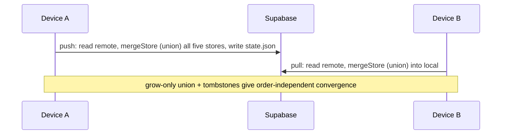
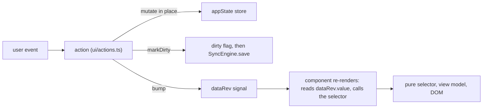

# Meridian architecture

Meridian is a personal, offline-first **fitness and study tracker** delivered as an
installable PWA. It runs entirely in the browser, persists locally, and syncs to the
cloud opportunistically. This document maps how the codebase is organized, the rules that
keep it coherent, and the load-bearing invariants you must not break.

> Audience: a developer changing this code. It describes the system **as built**, not a
> roadmap. Behavioral specs and style guides live in [`docs/`](docs/) (see
> [§15](#15-where-to-look-next)). Last checked against the code on 2026-09-29.

## Contents

1. [At a glance](#1-at-a-glance)
2. [Layering](#2-layering)
3. [Directory map](#3-directory-map)
4. [The data model: five synced stores](#4-the-data-model-five-synced-stores)
5. [Persistence and sync](#5-persistence-and-sync)
6. [The reactive UI](#6-the-reactive-ui)
7. [Navigation and Back](#7-navigation-and-back)
8. [Routes and bundles](#8-routes-and-bundles)
9. [Pure selectors](#9-pure-selectors)
10. [Feature notes](#10-feature-notes)
11. [Services, landing, and boot](#11-services-landing-and-boot)
12. [Telemetry and performance](#12-telemetry-and-performance)
13. [Testing](#13-testing)
14. [Build, PWA, and deploy](#14-build-pwa-and-deploy)
15. [Where to look next](#15-where-to-look-next)
16. [Invariants](#16-invariants)
17. [Cookbook: how to change things safely](#17-cookbook-how-to-change-things-safely)

---

## 1. At a glance

| | |
|---|---|
| **UI** | [Preact](https://preactjs.com/) + [`@preact/signals`](https://preactjs.com/guide/v10/signals/) (fine-grained reactivity) |
| **Language** | TypeScript, strict; ES modules; `@/` path alias for `src/` |
| **Build** | [Vite](https://vitejs.dev/); `tsc --noEmit` gates every build |
| **PWA** | [`vite-plugin-pwa`](https://vite-pwa-org.netlify.app/) (Workbox): precache and `autoUpdate`, offline-capable |
| **Theme** | Dark only (`<meta name="color-scheme" content="dark">` in `index.html`); there is no light theme or toggle |
| **Spaced repetition** | [`ts-fsrs`](https://github.com/open-spaced-repetition/ts-fsrs) (FSRS) through an adapter |
| **Landing** | [Three.js](https://threejs.org/), lazy-loaded behind an Enter gate, then kept as a passive background |
| **Persistence** | localStorage + IndexedDB (dual-write, self-healing) |
| **Cloud sync** | Supabase Storage: all five synced stores in one `state.json` object, grow-only CRDT merge (deletes through tombstones, see [§5](#5-persistence-and-sync)) |
| **AI** | OpenRouter to DeepSeek, brokered by a Supabase Edge Function proxy (the key is never on the device) |
| **Telemetry** | On-device only (`core/telemetry.ts`), shown in the Data tab's Performance and health panel; never sent or synced |
| **Tests** | [Vitest](https://vitest.dev/) + [fast-check](https://fast-check.dev/) property tests; jsdom for components |
| **Perf harness** | `npm run perf` (`perf/`): Puppeteer + Lighthouse against a local production build |
| **Deploy** | GitHub Actions to GitHub Pages on push to `main`, base `/meridian/` |

**Design principles**

1. **Offline-first.** Every read and write works with no network. Sync is an enhancement, never a dependency.
2. **Pure core, thin edges.** Domain logic is pure functions of `(state, today, config)`. The DOM, the clock, and the network live only at the edges.
3. **Derive, don't store.** User-facing numbers (mastery %, week strength, macros, tracker XP totals) are computed from the log, never cached. A cached number is a corruption surface.
4. **One-way data flow, opt-in reactivity.** State mutates through the actions layer, which bumps a single revision signal (`dataRev`). Each view subscribes by reading `dataRev.value`, so a bump re-renders exactly the views that opted in (the leaf-subscription rule, see [§6](#6-the-reactive-ui)).

---

## 2. Layering

The tree is **feature-sliced**. The load-bearing rule is about the **pure logic**, not the
whole tree: pure code points strictly downward, and **`core` imports nothing upward**. The
view components are a deliberate exception: they depend on `ui`, forming an intentional
`ui <-> views` cycle.


```mermaid
graph TD
    app["app/: bootstrap, render"]
    ui["ui/: signals, actions, App, components, charts"]
    views["features/*: view components"]
    fstores["features/*: signal-backed stores (trackerStore, teachingStore, roadmapStore, ...)"]
    selectors["features/*Selectors.ts: pure domain logic"]
    services["services/: ai, weather"]
    landing["landing/: Three.js gate + background"]
    core["core/: types, util, sync, storage, data, telemetry, ports"]

    app --> ui
    app --> landing
    app --> fstores
    ui --> views
    views -.->|intentional cycle: store, actions, host, charts| ui
    ui --> services
    views --> services
    ui --> selectors
    ui --> fstores
    ui --> core
    views --> fstores
    views --> selectors
    fstores -.->|appState| app
    selectors --> core
    services --> core

    classDef pure fill:#1e2a1e,stroke:#4a7;
    class core,selectors pure;
```

- **`core/`** has **no Preact and no upward imports**: types, utilities, the sync engine and
  merge algebra, the storage layer, seed data, the host ports (`appHost.ts`), and on-device
  telemetry. Most of it is DOM-free and unit-tested in a bare node environment; the
  exceptions are the browser adapters (`storage/adapters.ts`) and `telemetry.ts`, which use
  browser APIs behind guards.
- **`features/<domain>/`** owns one domain each. The classic slices (workout, meal,
  knowledge, data, todos, scratch) are a pure **`*Selectors.ts`** (imports only `core`) plus
  a **`*Tab.tsx`** view plus `types.ts`. The newer slices (studytracker, teaching, wgu) keep
  state in a small signal-backed store module instead (see [§10](#10-feature-notes)).
- **`ui/`** is the Preact application shell: the signal store, the actions (command layer),
  the root `App`, shared components, charts, and small browser helpers.
- **`services/`** wraps the two external I/O surfaces (AI, weather). Reached from
  `ui/actions.ts`, `features/today/TodayTab.tsx` (weather), and
  `features/teaching/TeachSection.tsx` (AI).
- **`app/`** wires everything together and renders.

**The rule (precise):** `*Selectors.ts` import only `core`; `core` imports nothing from
`ui`, `features`, or `app`. View components deliberately depend on `ui` (`store`, `actions`,
`host`, `charts`), while `ui/App.tsx` renders them, an accepted cycle. A second accepted
cycle: `features/studytracker/trackerStore.ts` reads `appState` from `app/bootstrap`, and
bootstrap imports `syncTrackerFromStore` and `ensureToday` from it. `readStore()` guards the
module-evaluation TDZ by falling back to an empty store. The payoff is that the pure layer
stays clean: grep any `*Selectors.ts` or `core/` file for `@/ui` or `@/app`; there are none.

---

## 3. Directory map

Folder-level, with one-line purposes. The code is the source of truth for exact filenames;
this map deliberately does not enumerate every leaf file.

```
src/
├── app/            # bootstrap.ts (composition root: stores, SyncEngine wiring, load gate, lifecycle), main.tsx (landing gate, render)
│
├── core/           # no Preact, no upward imports
│   ├── types.ts    # every persisted shape (WorkoutState, MealState, KnowledgeState, CoreState, TheoristState, ...)
│   ├── util.ts     # shiftDate, toId, toNum, tombstoneIds, pruneTombstones, ...
│   ├── appHost.ts  # the AppHost "ports" interface (the impure surface actions may use)
│   ├── coreSelectors.ts   # XP / streak / schedule logic over the core store
│   ├── telemetry.ts       # on-device metrics ring (spans, counts, errors, resource sampler)
│   ├── resourceBudgets.json  # approved resource limits, shared by HealthPanel and perf/run.mjs
│   ├── sync/       # SyncEngine.ts (save/push/pull/forcePush/discard; revs, backoff) · mergeStores.ts (the CRDT + sanitizeStore)
│   ├── storage/    # appState.ts (state owner, loaders, dirty flags) · store.ts (boot read/heal) · adapters.ts (storage + cloud adapters)
│   └── data/       # baked-in seed content (JSON) + a typed index
│
├── features/       # one slice per domain
│   ├── workout/    # progression, week-strength grading; away/home substitutes
│   ├── meal/       # calories/protein vs target (mealSelectors); body-weight trend (bodySelectors)
│   ├── knowledge/  # fsrs, ascent, knowledgeSelectors, source, questionBank, AscentSession, KnowledgeRail
│   ├── data/       # export/import/normalise (dataSelectors), DataTab, HealthPanel
│   ├── today/      # TodayTab: the home screen (hero, weather, at-a-glance tiles)
│   ├── todos/  scratch/   # small core-store features
│   ├── studytracker/      # "The Princeton Theorist": trackerStore (synced `theorist` store), curriculum, algorithms, papers, feed, journal
│   ├── teaching/   # Learn by Teaching: teachingStore (local), teachingTypes, TeachSection (mounted inside the tracker)
│   └── wgu/        # WGU roadmap: roadmapData (content), roadmapStore (local checklist), WGURoadmap view
│
├── ui/             # the Preact shell
│   ├── store.ts    # all UI signals (nav, per-tab state, dataRev, undo state)
│   ├── actions.ts  # the command layer: mutate, markDirty, bump; nav (handleBack, navHome); hubStats; undoable deletes; day rollover
│   ├── App.tsx     # brandrow + section router + chrome (RestBar, UndoToast, SaveChip) + screenKey; lazy-loads the tracker
│   ├── host.ts     # the concrete host adapter (readValue/setValue, confirm/prompt, status, reload)
│   ├── components/ charts/  # Chrome, Charts, SecHero · chart.ts (inline SVG) + progress.ts (series)
│   ├── externalLinks.ts  # iOS standalone: hand off-site links to Safari
│   ├── restTimer.ts  chime.ts  html.ts  tokens.ts  hubTypes.ts
│
├── services/       # ai.ts (proxy client) · weather.ts (Today's optional weather line)
├── landing/        # Three.js landing and background (graph, presets), lazy-imported
├── styles/app.css  # the main stylesheet (design tokens + component CSS)
└── perf.bench.ts   # Vitest micro-benchmarks (`npm run bench`)

perf/               # run.mjs (perf harness), routes.mjs (per-route vitals + screenshots), seed.mjs (synthetic history); results/ is gitignored
supabase/functions/openrouter-proxy/  # the AI proxy Edge Function
public/questions/   # the knowledge question bank (JSON, fetched at runtime)
```

**Styling and tokens.** Global CSS lives in `styles/app.css`, keyed off CSS custom
properties (`:root` design tokens). Two feature slices carry scoped stylesheets:
`features/studytracker/studytracker.css` (under `.pt-root`) and `features/wgu/wgu.css`
(under `.wgu-root`). `ui/tokens.ts` is a **hand-synced JS mirror** of the tokens (the
landing reads live values through `readToken`, since Three.js can't read CSS vars). The
component CSS is being incrementally migrated onto the tokens (see
[`docs/token-migration-plan.md`](docs/token-migration-plan.md)). If you change a color,
update **both** the `:root` var and the `tokens.ts` mirror.

---

## 4. The data model: five synced stores

State is split into **five independently persisted stores** (`StoreKey` in
`core/sync/SyncEngine.ts`). Their keys are historical internal names, frozen because
renaming would invalidate every device's localStorage and IndexedDB keys and the cloud
object shape. Keep this Rosetta stone handy:

| Store key | Local key | Domain | Holds | Loaded |
|-----------|-----------|--------|-------|--------|
| `core` | `meridian-core` | Cross-cutting | `schedule`, `entries` (the XP ledger), `todos`, `scratch` | At boot |
| `overload` | `overload-tracker-state` | **Workout** | `days` (sets by date), `bw`, `rpe`, `done`, `reopened`, `incr`, `sessionDone`, `settings` | Lazily |
| `surplus` | `surplus-tracker-state` | **Meal** | `days` (meals by date), `tad`, `settings` | Lazily |
| `csgraph` | `csgraph_profile_v2` | **Knowledge** | `mastery`, `srs` (FSRS), `log`, `gymDone`, `generated` (AI pool), `resetAt`/`genDiscarded` (tombstones) | Lazily |
| `theorist` | `meridian-theorist` | **Study tracker** | `banked` (date to XP), `day` (today's blocks, scores, events, dayType), `dayTouchedAt`, `mastery` (per-topic decaying), `resetAt` | At boot |

Workout, meal, and core carry an optional `_del` tombstone map. **`KnowledgeState` and
`TheoristState` have none**; each uses a `resetAt` epoch instead (see
[§5](#5-persistence-and-sync)). The monotonic revision is **not** on the store shapes. It
lives on the cloud payload (one `rev` for the whole `state.json`), with a per-store rev
counter inside the sync engine that guards in-flight saves.

The question bank (knowledge content) is **not** in a store. It's static JSON in
[`public/questions/*.json`](public/questions/), fetched at runtime and cached. Only progress
(keyed by card id) lives in `csgraph`, so a card studied in any mode (Today's path, a focused
review, an interview deck, an AI-generated card) updates one unified mastery.

### Local-only state (not synced)

Several features keep small, device-local state in namespaced localStorage keys. These are
**not** routed through `appState` or the SyncEngine, are not in `state.json`, and are not in
the export bundle.

| Key | Owner | Holds |
|-----|-------|-------|
| `meridian.teach.v1` | `features/teaching/teachingStore.ts` | Today's Learn-by-Teaching loop (stage, plan, transcript, evaluation, office hours) |
| `meridian.roadmap.v1` | `features/wgu/roadmapStore.ts` | WGU course checklist |
| `meridian.proofjournal.v1` | `features/studytracker/proofJournalStore.ts` | Proof and derivation journal |
| `meridian.papers.v1` | `features/studytracker/papers.ts` | Paper-pass progress |
| `meridian.curriculum.v1` | `features/studytracker/curriculum.ts` | Per-course completion |
| `meridian.feed.v2` | `features/studytracker/feedSources.ts` | Daily HN reading feed cache |
| `meridian.tracker.ui.v1`, `meridian.tracker.tab.v1` | `features/studytracker/uiState.ts` | Open sections, active sub-tab |
| `meridian.telemetry.v1` | `core/telemetry.ts` | Telemetry ring |
| `meridian_weather`, `meridian_city` | `services/weather.ts` | Cached reading, saved city |
| `meridian_supabase_url`, `meridian_supabase_key` | `app/bootstrap.ts`, `services/ai.ts` | Sync and AI proxy configuration |

XP earned inside local-only features (teaching, journal, papers, reading notes, algorithm of
the day) reaches the synced `theorist` store through `trackerStore.creditEvent`, which is
day-scoped and max-merged, so a repeat can't double-pay.

---

## 5. Persistence and sync

### Local persistence (`core/storage/`)

`appState` is the state owner: it loads each store (`loadCore`, `loadWorkout`, `loadMeal`,
`loadKnowledge`, `loadTheorist`), tracks a per-store dirty flag (`markWorkoutDirty`,
`markMealDirty`, `markKnowledgeDirty`, `markTheoristDirty`, `markDirty`), and flushes on
demand. The storage adapter (`adapters.ts`) **dual-writes** every store to **localStorage**
(synchronous, survives a hard kill mid-write) and **IndexedDB** (durable, larger quota). The
boot read and heal path (`store.ts`) reads across the local backends (and a Claude-account
`window.storage`, when present), takes the newest-versioned copy, and **heals** the others
toward it, so all backends converge after a partial write.

### The load gate (`app/bootstrap.ts`)

Only `core` and `theorist` load at boot. `overload`, `surplus`, and `csgraph` load lazily
(when a tab needs them, or when Today mounts and calls `loadForHome`). Until a store loads,
`stores[key]` is an empty placeholder, and syncing a placeholder is destructive. So:

- A store joins a save, and its write-back, only after `markStoreLoaded(key)`.
- Pulls, force-pushes, and cloud pushes call `whenAllLoaded()`, which starts every loader
  and rejects after 15 s if they don't finish.
- Saves made before the gate opened are local-only; once every store loads, a pending save
  publishes them.
- `writeBack` never overwrites a store the user edited during an await. It merges the edit
  with the engine's copy and marks the state dirty.

### Cloud sync (`core/sync/`)

`SyncEngine` mirrors **all five stores into one Supabase Storage object** (`state.json`)
under one monotonic `rev`. One atomic object keeps read, merge, write consistent; the
trade-off is that the stores can't sync independently even though they persist
independently locally, which is acceptable for a single user. It is conservative by design:

- `save()` writes locally and pushes if online, sync is configured, and every store has
  loaded. A `sanitize` hook (`sanitizeStore`) prunes old `_del` tombstones before each write.
- `push()` reads the cloud copy, **folds it in through `mergeStore`**, then writes the union
  back, so a push never clobbers another device's work. A rate-limit backoff (30 s), a
  minimum push gap (4 s), and the per-store rev counters (a save can't overwrite a change
  made after it started) keep it quiet.
- `pull()` merges the cloud copy into local. Offline and HTTP errors come back in the result,
  and the bootstrap wrapper turns them into a thrown error so callers can't mistake them for
  "already up to date".
- `forcePush(only?)` overwrites the cloud for a scoped set of stores, **skipping** the
  fold-in. Used only for a deliberate wipe (for example, "Reset knowledge" is
  `forcePush(['csgraph'])`), never in the hot path.
- `discard()` restores the last saved state.

**Lifecycle** (`wireLifecycle` in bootstrap): on `visibilitychange` to hidden, `pagehide`,
and `beforeunload`, `handleHide()` first applies any pending undoable delete, then flushes
synchronously. On return to the foreground with nothing dirty, it pulls. On `online`, it
saves anything that failed to reach the cloud. Cmd/Ctrl+S saves.

### Undoable deletes (`ui/actions.ts`)

`deleteWithUndo(id, label, commit)` hides the row at once (`pendingDeletes` signal; lists
filter with `notPending`) and shows the `UndoToast`. The real delete, with its tombstone,
runs only when the 5 s toast expires, another delete replaces it, or the app goes to the
background. Undo just unhides the row, so nothing was ever written or synced. This design
exists because undoing an applied delete can't work: the tombstone reaches the cloud within a
second and wins every merge after that. Used for sets, meals, todos, scratch cards, and
discarded AI cards.

### The merge algebra (`mergeStores.ts`): a grow-only CRDT

`mergeStore(key, local, remote, localWins)` dispatches to a per-store merge. The primitives:

- **`unionById`**: arrays of `{id}` merge by union; a `_del` tombstone set removes an id everywhere.
- **`mergeScalarMap`**: `{id: value}` maps union; `localWins` breaks a same-key conflict.
- **`mergeDayMap`**: `{date: item[]}` merges each day with `unionById`, dropping empty days.

Because the base merge is **grow-only**, deletion needs tombstones. Workout, meal, and core
carry a `_del` map. **Knowledge and the tracker have none.** Each uses a monotonic
**`resetAt` epoch**: a reset bumps `resetAt` and empties the store, and the merge discards
any side older than the newest epoch, so the wipe propagates and sticks. Knowledge adds a
second tombstone, **`genDiscarded`** (a grow-only id set), so a discarded generated card
can't resurrect from another device.

`mergeTheorist` specifics: `banked` is per-key `Math.max`; `day` goes to the later ISO date,
or is unioned on a tie; `day.events` is per-key max; `dayType` is last-writer-wins by
`dayTouchedAt` (tie prefers `'light'`); `mastery` is per-topic last-writer-wins by the larger
`reviewedAt`. Un-banking a day is authoritative only until a device that still holds that
day's value syncs.


```mermaid
sequenceDiagram
    participant A as Device A
    participant Cloud as Supabase
    participant B as Device B
    A->>Cloud: push: read remote, mergeStore (union) all five stores, write state.json
    B->>Cloud: pull: read remote, mergeStore (union) into local
    Note over A,B: grow-only union + tombstones give order-independent convergence
```

---

## 6. The reactive UI

Meridian does not use a store framework. It uses **signals** plus a single revision counter.

- **`ui/store.ts`** declares UI state as signals: navigation (`currentTab`, `kgSession`),
  per-tab state (`wkDate`, `kgTopic`, `sgLogOpen`, ...), undo state (`pendingDeletes`,
  `undoToast`), and the keystone: `dataRev = signal(0)` with `bump()`.
- **`ui/actions.ts`** is the command layer. Every action mutates a store in place, calls
  `appState.markXDirty()`, then **`bump()`s `dataRev`**. Actions are the only sanctioned
  mutators of the four classic stores.
- **The tracker is the exception.** `trackerStore.ts` owns its own mutators. Each reads the
  current `TheoristState`, builds the next one immutably, and `commit()`s it
  (`appState.set('theorist', ...)`, `markTheoristDirty()`), then re-projects the
  `trackerState` signal. Views subscribe to `trackerState`, not `dataRev`. After a pull or
  discard, bootstrap's `onExternalChange` calls both `bump()` and `syncTrackerFromStore()`.
- **Components** read a bare `dataRev.value;` at the top of their render function (Preact
  auto-subscribes any signal read during render), then call the pure selector directly.


```mermaid
graph LR
    evt["user event"] --> act["action (ui/actions.ts)"]
    act -->|mutate in place| store["appState store"]
    act -->|markDirty| dirty["dirty flag, then SyncEngine.save"]
    act -->|bump| rev["dataRev signal"]
    rev --> comp["component re-renders: reads dataRev.value, calls the selector"]
    comp --> sel["pure selector, view model, DOM"]
```

**The leaf-subscription invariant.** A parent reading `dataRev` does **not** re-render a
child that didn't read it. **Every store-deriving component must read `dataRev.value`
itself.** Forgetting this is the classic Meridian bug: a tab that silently goes stale after
a mutation.

### The host and ports adapter

Actions occasionally need impure browser capabilities: uncontrolled input values through
`readValue`/`setValue` (reading a rendered `<input id=...>` by id, a pragmatic escape from
the signal model), `confirm`/`prompt`, `reload`, and transient `status` lines addressed by
element id. These ports are declared in the **`AppHost`** interface (`core/appHost.ts`) and
provided by **`ui/host.ts`**, which implements the lean subset the app uses (the broader
`AppHost` surface is legacy from the pre-Preact renderer).

---

## 7. Navigation and Back

Home is the **Today** screen. Every other screen is a drill-in section reached from Today's
at-a-glance tiles, with no persistent nav bar. The brand row shows a Back pill and a Home
button on every non-home screen.

Navigation is modeled on the **browser history stack**, so an installed PWA gets real
hardware and edge-gesture Back. The mechanics (in `ui/actions.ts` and `ui/App.tsx`):

- **One history entry per drill-in.** Opening a section (`openSection`) and any deeper push
  (a knowledge mode, topic, or deck; a workout exercise detail; the meal log) calls
  `pushState()` and increments a `navDepth` counter. `openSection` also calls `navStart(tab)`
  for telemetry.
- **`popstate` is the only Back driver.** The chrome Back pill, hardware Back, and the OS
  gesture all fire `popstate`, then `onPopNav()` (decrements `navDepth`), then
  **`handleBack()`**. In-app back controls call `window.history.back()`, never a state setter,
  so history and `navDepth` stay in sync.
- **`handleBack()` is a precedence-ordered unwind.** It peels one sub-screen at a time before
  leaving a section: workout exercise detail to list; meal log to meal; knowledge gym screen
  to picker, progress to gallery, interview deck to picker, home study to gallery, any mode to
  the chooser. Guards stop a stale sentinel (a leftover `kgTopic='__today__'`) from
  dead-ending Back. When nothing is left to unwind, it falls through to `goHome()`.
- **`navHome()`** jumps straight to Today with `history.go(-navDepth)`, leaving the history
  stack clean.
- **`screenKey` and `paneIn`.** `App.tsx` computes a per-sub-screen `key` whose sole job is to
  replay the entrance animation on each transition. It must enumerate each distinct
  sub-screen (and mirror the `KnowledgeView` router). Add a knowledge sub-screen and forget
  `kgKey`, and the entrance animation won't replay.
- **Tracker and WGU sections** have no history-level sub-screens. The tracker's
  Standard/Playbook switch is a segmented control (`uiState.activeTab`), not navigation.

**Rule:** any new sub-screen must (a) `pushState()` on entry, (b) get a branch in
`handleBack()`, and (c) get a distinct `screenKey`. Miss one and Back or the entrance
animation breaks (see [§17](#17-cookbook-how-to-change-things-safely)).

---

## 8. Routes and bundles

The `Tab` union in `ui/store.ts` defines the screens. `Section` in `ui/App.tsx` routes them.
Pane ids are in `PANE_ID` (the meal pane is historically `#pane-weight`).

| Tab id | Screen | Component | Chunk |
|--------|--------|-----------|-------|
| `today` | Today (home) | `features/today/TodayTab.tsx` (`TodayView`) | Main |
| `todos` | Todos | `features/todos/TodosTab.tsx` (`TodosView`) | Main |
| `scratch` | Scratchpad | `features/scratch/ScratchTab.tsx` (`ScratchView`) | Main |
| `knowledge` | Knowledge | `features/knowledge/KnowledgeTab.tsx` (`KnowledgeView`) | Main |
| `tracker` | Princeton Roadmap | `features/studytracker/StudyTracker.tsx` (`StudyTrackerView`) | **Lazy** (`StudyTracker` chunk) |
| `roadmap` | WGU Roadmap | `features/wgu/WGURoadmap.tsx` (`WGURoadmapView`) | Main |
| `workout` | Workout | `features/workout/WorkoutTab.tsx` (`WorkoutView`) | Main |
| `meal` | Food and Body | `features/meal/MealTab.tsx` (`MealView`) | Main |
| `data` | Data | `features/data/DataTab.tsx` (`DataView`) | Main |

A production build emits three JS chunks:

- **Main** (`index-*.js`): the shell and every route above except `tracker`.
- **`StudyTracker-*.js`** (plus `StudyTracker-*.css`): the tracker view and everything only
  it imports (algorithm catalogue, proofs, papers, feed, journal, and the Learn-by-Teaching
  section). `App.tsx` loads it with `import()`, prefetches it at idle right after Enter, shows
  a loading placeholder until it resolves, and offers **Try again** if the import fails.
  `trackerStore.ts` itself stays in the main chunk, because bootstrap, `actions.ts`
  (`trackerSummary`), and Today need it.
- **Landing** (`index-*.js`, the largest, mostly Three.js): imported dynamically by
  `app/main.tsx`; not a route.

Telemetry counts a lazy pane as opened only when its real content renders, not its
placeholder. Check `npm run perf` or a scratch `vite build` for current sizes.

---

## 9. Pure selectors

Every classic domain's logic is a set of **pure functions** in
`features/<domain>/*Selectors.ts`:

```
selectWorkoutView(state, date, today, overrides?, config?) → WorkoutViewModel
```

Rules that make them trustworthy and testable:

- **No clock.** "Today" is always an explicit parameter. Selectors never call `Date.now()`, so
  date-dependent behavior (split alternation, overdue reviews, weekly volume) is reproducible.
- **No DOM, no `innerHTML`, no module-level mutable state.** Deterministic in, deterministic out.
- **Config-injected.** Thresholds live in a `config` object (`DEFAULT_CONFIG`, `DEFAULT_SRS`) so
  behavior is tunable and tests can pin exact numbers.

This lets the suite lean on **fast-check property tests**: feed thousands of random states and
assert invariants (an interval never goes negative, a derived weight always lands on the
machine's increment, export then import is the identity).

The tracker's derivations (`dayXP`, `levelIndex`, `meterPct`, `streakDays`,
`currentMastery`, `weeklySessions`) live in `trackerStore.ts`, not a `*Selectors.ts`. Some
take an optional `now` for tests, but several read the live store or the wall clock, so they
don't meet the rules above.

---

## 10. Feature notes

- **Workout** (`features/workout/`): auto-progression (the top set drives the load; hit the
  rep ceiling, add an increment), layoff and stall auto-deloads, and an at-a-glance
  **week-strength grade** (Weak/Moderate/Strong) from habitual-staple lifts. Away/home mode
  swaps each machine slot for a dumbbell substitute; the selectors canonicalize substitute
  and gym-slot identity so grading, lists, and charts stay consistent across modes. Cardio
  logs time and distance, not lb x reps. Rest between sets is driven by **`ui/restTimer.ts`**,
  a small state machine with an injected clock, bound to one exercise at a time. It bridges
  to the `RestBar` chrome through a signal, and on completion plays **`ui/chime.ts`** (a
  two-tone Web Audio chime plus vibration where supported; `unlockChime` runs inside the
  starting tap because iOS only allows audio after a gesture).
- **Meal** (`features/meal/`): calories and protein per day against a maintenance-plus-surplus
  target; body-weight trend selectors (`bodySelectors.ts`).
- **Knowledge** (`features/knowledge/`), the largest classic slice:
  - **FSRS** scheduling through the `fsrs.ts` adapter (`ts-fsrs`); `knowledgeSelectors.ts` adds
    the due-queue, interview-deck, and streak selectors (it also carries a legacy SM-2
    scheduler used only by tests). Cards come from `public/questions/*.json` (schema in
    [`docs/knowledge-question-schema.md`](docs/knowledge-question-schema.md), voice in
    [`docs/knowledge-style-guide.md`](docs/knowledge-style-guide.md)).
  - **AscentSession**: the study "climb", one persistent card node whose recede and advance
    animation replays without remounting; Reveal, 4-grade FSRS rating, and Skip (auto "Again").
  - **Study-mode router**: the tab opens on a chooser (**At Home / Gym / Interview**).
    Interview presets select cards by tag and serve a relevance-first, topic-diverse
    (round-robin) capped deck. All modes feed the same FSRS and mastery.
  - **AI generator**: "Generate cards" calls the proxy, validates output, and stores it in a
    separate `generated` pool (AI-labeled), studyable like any card but excluded from the
    curated-curriculum mastery %. Discarding a card goes through `deleteWithUndo`.
- **Today** (`features/today/`): the home screen. A read-only hero (greeting, clock, optional
  weather) and at-a-glance tiles. The tile data comes from `hubStats()` in `ui/actions.ts`
  (types in `ui/hubTypes.ts`), which reads every store, so `App` calls `loadForHome()` on mount.
- **Data** (`features/data/`): export, import, and normalise (`dataSelectors.ts`) for all five
  synced stores; the round-trip is a tested identity, and normalisation is the sanitizer for
  the backup path. Also hosts the **Performance and health** panel (see
  [§12](#12-telemetry-and-performance)).
- **Study tracker** (`features/studytracker/`, "The Princeton Theorist", Today tile "Princeton
  Roadmap"): a gamified daily study instrument. The 0/1/2 scorecard is the single daily
  input: it fills five meters and earns the day's XP (`dayXP` = scores x `SCORE_UNIT` plus
  `day.events`). Schedule blocks are a 0-XP checklist. Economy events (`EVENT_WEIGHTS`:
  retrieval, paper reproduce, topic review, algorithm studied, journal save) credit through
  `creditEvent`. Topic mastery decays with a 30-day half-life. The view has two sub-tabs:
  the Standard surface (reading feed, Princeton theory reading, algorithm of the day with
  Prove It Yourself, Learn by Teaching, courses and psets, schedule, check-in) and Playbook.
  The spec is [`docs/massey-standard-2026-09-19.md`](docs/massey-standard-2026-09-19.md).
  - **Auto-bank on rollover.** `ensureToday()` runs at boot and from `rolloverIfNewDay()`
    (on return to the foreground and every 60 s). When the stored day isn't today, it banks
    the old day's XP under its own date (max with anything already banked) before starting a
    fresh day. At boot this runs before the first pull, so another device's newer day can't
    replace this device's unbanked one. `rolloverIfNewDay()` also moves the workout and meal
    dates forward if they were following today.
  - **Light Sabbath.** Inside an approximate Friday 6 PM to Saturday 8 PM local window, an
    unset `dayType` becomes `'light'`, which lowers the weekly-session bar. A manual
    Full/Light toggle overrides it.
- **Learn by Teaching** (`features/teaching/`): a five-stage loop (Designer, Present,
  Evaluate, Office Hours, Scorecard) on the algorithm of the day, mounted as a section inside
  the tracker (so it ships in the lazy chunk). It has no screen of its own: the old `teach` tab id is an alias of `tracker`. Office hours uses four AI student personas that
  probe the user's actual transcript (`gradeLecture`, `officeHoursQuestions`, `gradeDefense`
  in `services/ai.ts`). Loop state is local-only (`meridian.teach.v1`); XP flows to the
  tracker through `creditEvent`. `teachingStore.ts` has no network dependency; the view maps
  AI results onto its data model. Spec:
  [`docs/learn-by-teaching-2026-09-20.md`](docs/learn-by-teaching-2026-09-20.md).
- **WGU roadmap** (`features/wgu/`): a read-only, week-by-week plan for the enrolled courses
  (`roadmapData.ts`) with a per-course done checkbox persisted locally (`roadmapStore.ts`,
  `meridian.roadmap.v1`). `roadmapSummary()` feeds the Today tile.

---

## 11. Services, landing, and boot

- **`services/ai.ts`**: one `aiCall()` entry point plus task helpers (`estimateMacros`,
  `generateQuestions`, `gradeLecture`, `officeHoursQuestions`, `gradeDefense`). Requests go to
  a **Supabase Edge Function** (`openrouter-proxy`, source in `supabase/functions/`) that
  holds the OpenRouter key and forwards to DeepSeek; the key is **never on the device**.
  Supports a strict `jsonMode` and an abort timeout (45 s default) so a hung proxy can't wedge
  a caller. Callers: macro estimation, AI answer and grade, the card generator (all in
  `ui/actions.ts`), and Learn by Teaching. **Local setup:** AI and cloud sync need the Supabase
  URL and anon key configured on-device (through the Data tab). With none set, `aiCall`
  returns `no proxy` and the app degrades to offline-only.
- **`services/weather.ts`**: Today's optional weather line from Open-Meteo (no key, no
  proxy). Resolves by a saved city (forward-geocoded) or geolocation (reverse-geocoded for a
  label). Any failure falls back to the last cached reading; its absence never blocks the tab.
- **`ui/externalLinks.ts`**: an iOS home-screen app opens `target=_blank` links in an in-app
  sheet that blocks Meridian until dismissed. `installExternalLinks()` (called in
  `main.tsx`) intercepts clicks on off-origin http(s) links, only when
  `navigator.standalone` is true, and rewrites them to `x-safari-https://...` so Safari
  opens them. Elsewhere it does nothing.
- **Daily reading feed** (`features/studytracker/feedSources.ts`): queries the HN Algolia API
  directly from the browser (CORS-friendly, no proxy), ranks by a curated domain allowlist
  and theme heuristics, and caches per day.
- **Landing and boot (`app/main.tsx`).** `startTelemetry()` and `installExternalLinks()` run
  first. The Three.js landing is imported **lazily**, and **nothing boots until Enter**: the
  body starts in a `pre-enter` state; on Enter, `boot()` runs and `render(<App/>)` mounts,
  then a short "leaving" teardown drops the landing. The graph then remounts as a passive
  background (`mountBackground` into `#bg-graph`). If the Three.js import fails, a plain click
  handler still enters, so a blocked landing can never lock the user out.
- **`boot()` (`app/bootstrap.ts`)**: `appState.init()`, wire lifecycle, load `core` and
  `theorist`, project the tracker signal, run `ensureToday()` (auto-bank), `bump()`, paint the
  save chip, and, if sync is configured, pull after 2 s.

---

## 12. Telemetry and performance

### On-device telemetry (`core/telemetry.ts`)

First-party and local: one localStorage key (`meridian.telemetry.v1`), never sent anywhere,
never synced or exported. Each metric is a capped ring (50 samples; 20 errors). Recording is
an O(1) push; persistence happens only when the page is hidden, so nothing touches storage on
the hot path.

- **API:** `record`, `count`, `error`, `span` (returns an end function), `afterPaint`, and
  `navStart`/`navEnd` (tab open time, from the action that switches tabs to the frame after
  the pane renders).
- **Page-load vitals:** FCP, LCP, CLS, TTFB, DCL, and worst interaction per session (an INP
  stand-in), from `PerformanceObserver`. Long tasks where supported.
- **Resource sampler:** while visible, a 250 ms heartbeat estimates main-thread busy % from
  timer lateness, and each window of at least 10 s also records DOM node count and JS heap
  (Chromium only). Windows spanning a suspension are dropped.
- **Sync:** `sync:save`/`sync:pull` spans and outcome counts are recorded in bootstrap.
- **Errors:** `window` `error` and `unhandledrejection` are captured.

### Performance and health panel (`features/data/HealthPanel.tsx`)

A collapsed section in the Data tab that computes nothing until opened. It shows p50/p95 for
load vitals, per-tab open time, sync health, resource samples, storage use per store, quota,
service worker and cache state, and recent errors, graded against web.dev cut-offs and the
limits in **`core/resourceBudgets.json`**. It can reset the ring or copy it as JSON.

### Resource budgets (`core/resourceBudgets.json`)

The approved limits (idle CPU, main-thread busy idle and active, longest task, JS heap, DOM
nodes, renderer RSS). The in-app panel and `perf/run.mjs` read the same file; change limits
there only.

### Perf harness (`perf/`)

See [`perf/README.md`](perf/README.md). In short:

- `npm run perf` builds, serves the production bundle with `vite preview`, and measures it in
  headless Chrome (Puppeteer + Lighthouse): build sizes, load metrics, and per-tab open time
  on empty and seeded data. Every off-origin request is blocked.
- `--only runtime | load | resources`, `--check` (exit 1 over budget), and
  `--against <ref>` (interleaved A/B runs; use this to judge a change, since separate runs
  compare noise).
- `perf/seed.mjs` builds a deterministic synthetic history in the exact shape `appState`
  loads. `perf/routes.mjs` records per-route vitals, bytes, and screenshots against a built
  `dist/`.
- Results go to `perf/results/` (gitignored).

---

## 13. Testing

- **Vitest**, run with `npm test`. Roughly one test file per selector or module plus component
  tests. `npm run bench` runs `src/perf.bench.ts`.
- **Pure selectors** get **fast-check property tests**: invariants over many random states.
  `FC_RUNS` scales the count (100 by default); `npm run test:deep` runs at 10,000. To
  reproduce a failure, copy the printed `seed` and `path` into the failing property's options.
- **Components** get `@testing-library/preact` tests under **jsdom**, mapped by
  `environmentMatchGlobs` in `vitest.config.ts` (`*.test.tsx` plus `actions.test.ts`); the
  pure `*.test.ts` files keep the faster node default. `src/test/setup.ts` installs an
  in-memory localStorage.
- **Reality-check tests are mandatory for user-facing numbers.** For every displayed % or
  grade, pin a known-state to expected-value test, not only an internal-consistency property.
  A wrong denominator can be self-consistent yet wrong (the mastery-% bug that motivated this
  rule).
- **Change discipline:** substantive work is built, then adversarially reviewed before it
  ships. `npm run verify` (`typecheck && test && build`) is the pre-push gate.

---

## 14. Build, PWA, and deploy

```
npm run dev       # Vite dev server (HMR)
npm run build     # tsc --noEmit && vite build, into dist/
npm run preview   # serve the built app under /meridian/
npm run verify    # typecheck + test + build (the pre-push gate)
npm run perf      # perf harness (see §12)
```

- **Base path** is `/meridian/` (project Pages site). Never assume root.
- **PWA:** `vite-plugin-pwa` (Workbox) precaches the built assets, including the question bank
  and the lazy tracker chunk, and registers with `autoUpdate`, so the installed app works
  offline and refreshes on the next load. Cross-origin requests (Supabase, AI, weather, HN)
  are never cached.
- **Deploy:** [`.github/workflows/deploy.yml`](.github/workflows/deploy.yml) builds
  (`npm ci && npm run build`) and publishes `dist/` to **GitHub Pages on every push to
  `main`**. There is no staging branch; `main` is production.

---

## 15. Where to look next

- **Behavioral source of truth** (the why behind the selectors): the engine specs in `docs/`,
  [`workout-nutrition-engine-spec.md`](docs/workout-nutrition-engine-spec.md) and
  [`knowledge-engine-spec.md`](docs/knowledge-engine-spec.md).
- **Study tracker and teaching specs:**
  [`massey-standard-2026-09-19.md`](docs/massey-standard-2026-09-19.md),
  [`learn-by-teaching-2026-09-20.md`](docs/learn-by-teaching-2026-09-20.md).
- **Content authoring:** [`knowledge-question-schema.md`](docs/knowledge-question-schema.md),
  [`knowledge-style-guide.md`](docs/knowledge-style-guide.md).
- **Performance:** [`perf/README.md`](perf/README.md).
- **Migrations and history:** the `app.ts` to Preact-signals migration
  ([`app-ts-migration-plan.md`](docs/app-ts-migration-plan.md)) and the token migration
  ([`token-migration-plan.md`](docs/token-migration-plan.md)).

---

## 16. Invariants

Break one of these and something drifts silently. Each links to the section that explains why.

1. **Leaf subscription.** Every store-deriving component reads `dataRev.value` itself (tracker views read `trackerState`). *([§6](#6-the-reactive-ui))*
2. **Selectors are pure.** No `Date.now()`, no DOM, no module-level mutable state; "today" is a parameter. *([§9](#9-pure-selectors))*
3. **Derive user-facing numbers; never persist them.** A stored grade or percentage is a stale cache and a corruption surface. *([§1](#1-at-a-glance))*
4. **Mutate only through actions** (or `trackerStore`'s `commit` for `theorist`). Then mark dirty and bump or re-project. Nothing else writes a synced store. *([§6](#6-the-reactive-ui))*
5. **Merges are grow-only.** Deletion needs a tombstone (`_del`, `resetAt`, `genDiscarded`); a plain delete resurrects on sync. User-facing deletes go through `deleteWithUndo`. *([§5](#5-persistence-and-sync))*
6. **Persist a new field in all three state-rebuilding paths.** A new synced store field must be handled in `appState` load, `mergeStores`, **and** `dataSelectors.normalise*`, or it's silently dropped on reload, sync, or backup. *([§5](#5-persistence-and-sync), [§17](#17-cookbook-how-to-change-things-safely))*
7. **Don't sync a placeholder.** A lazily loaded store joins saves only after `markStoreLoaded`; pulls and pushes wait on `whenAllLoaded`. *([§5](#5-persistence-and-sync))*
8. **Keep the pure layer pure.** `*Selectors.ts` import only `core`; `core` imports nothing upward. Views may import `ui` (intentional). *([§2](#2-layering))*
9. **Every new sub-screen wires nav.** `pushState()` on entry, a `handleBack()` branch, and a distinct `screenKey`. *([§7](#7-navigation-and-back))*
10. **Keep heavy, tracker-only code out of the main chunk.** Importing a `features/studytracker/` or `features/teaching/` view module from the shell pulls it into the main bundle. Only `trackerStore.ts` belongs there. *([§8](#8-routes-and-bundles))*
11. **`@/` alias, not deep relative paths.** Imports resolve from `src/`.
12. **Respect the base path and the iOS safe area.** Assets live under `/meridian/`; full-bleed screens must offset `env(safe-area-inset-top)`.
13. **Keep the five-store Rosetta stone in mind:** `core`, `overload` = workout, `surplus` = meal, `csgraph` = knowledge, `theorist` = study tracker. *([§4](#4-the-data-model-five-synced-stores))*

---

## 17. Cookbook: how to change things safely

### Add a field to a synced store

The trap is invariant 6: a field lives in **three** rebuild paths. Miss one and it's dropped
on reload, sync, or backup.

1. **Type:** add it to the store shape in `core/types.ts`.
2. **Load:** copy it through in `appState.loadX` (`core/storage/appState.ts`).
3. **Merge:** handle it in `mergeX` (`core/sync/mergeStores.ts`). Pick the right primitive
   (`unionById`, `mergeScalarMap`, `mergeDayMap`); if it can be deleted, add a tombstone.
4. **Normalise:** preserve it in `normaliseX` (`features/data/dataSelectors.ts`).
5. **Test:** a normalise round-trip identity test that seeds the new field, plus a merge test
   if it has delete semantics.

For state that doesn't need to sync, prefer a namespaced local key (`meridian.<feature>.vN`)
owned by a small signal store, as teaching and WGU do, and list it in [§4](#4-the-data-model-five-synced-stores).

### Add a new section (tab)

1. **Store signals:** extend the `Tab` union and add UI state in `ui/store.ts` (and a
   `dataRev` read wherever it's derived).
2. **Actions:** a loader and the commands in `ui/actions.ts` (mutate, `markXDirty`, `bump`);
   wire the loader into `ensureLoaded` if the section needs a lazy store.
3. **Router and chrome:** add the pane id to `PANE_ID` and a branch in `Section` in
   `ui/App.tsx`; add a distinct `screenKey` branch if it has sub-screens. For a heavy section,
   load it with `import()` as the tracker does.
4. **Entry point:** add a tile to `hubStats()` so Today can open it through `openSection`, and
   a label in `HealthPanel`'s `TAB_LABELS`.
5. **Navigation:** `pushState()` on any drill-in and a `handleBack()` branch (invariant 9).
6. **Slice:** `features/<domain>/` with a pure `*Selectors.ts` (imports only `core`), the view,
   and `types.ts`.
7. **Test:** property tests for the selectors, a component test that asserts each control fires
   the matching action, and a reality-check test for any user-facing number. Update
   `perf/routes.mjs` if its selectors no longer match the shell.

### Ship it

`npm run verify` (typecheck + test + build) is the gate. Use `npm run perf -- --against <ref>`
for changes that could move load or tab-open time. Substantive changes get an adversarial
review before push. `main` auto-deploys; there is no staging.
